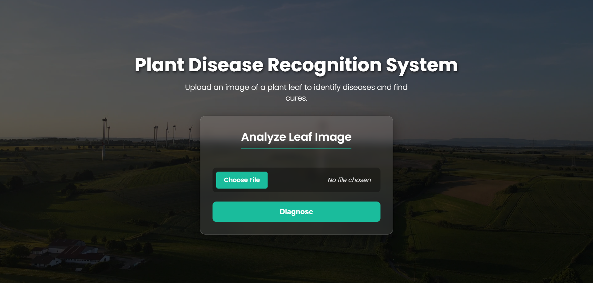
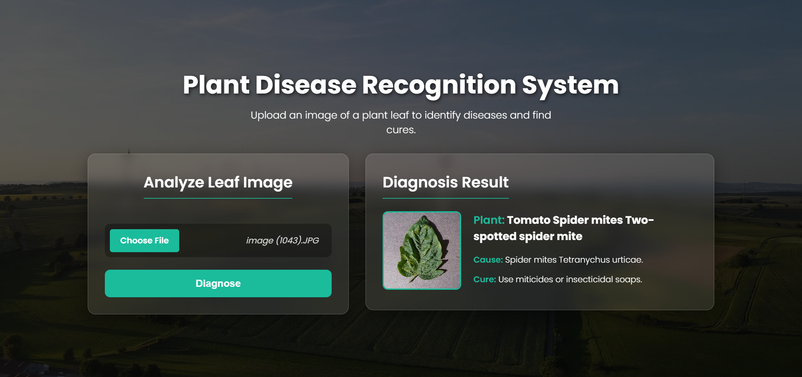
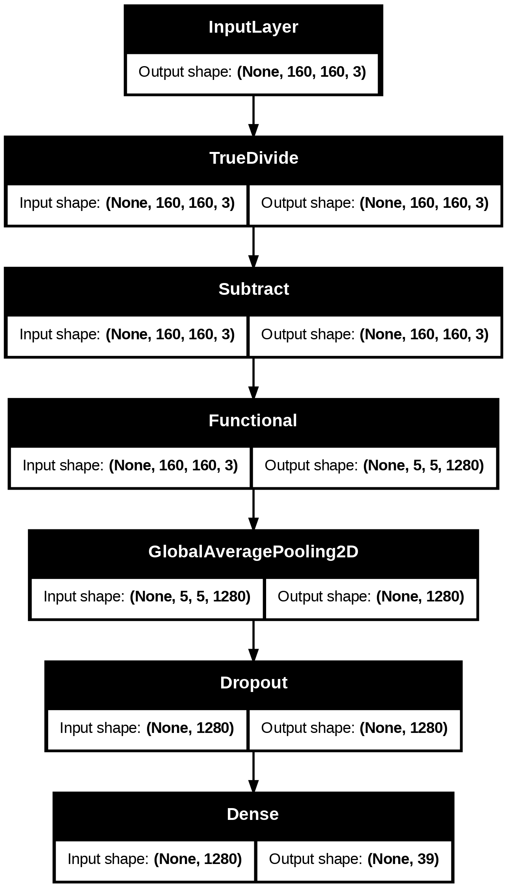
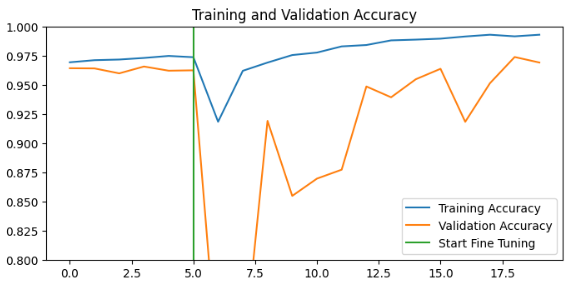
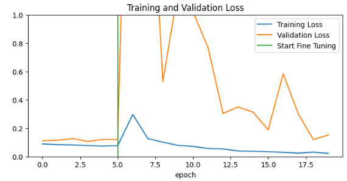

# 🌱 Plant Disease Recognition System 

<h3>Live : https://plant-disease-recognition-hip3.onrender.com</h3>

[](https://www.python.org/)
[](https://tensorflow.org/)
[](https://flask.palletsprojects.com/)

A sophisticated deep learning-powered web application that identifies plant diseases from leaf images and provides actionable treatment recommendations. Built with TensorFlow and Flask, this system achieves **97.11% accuracy** in detecting 39 different plant diseases across multiple crop species.

<div align="center">
  
  
</div>

## 🎯 About This Project

### What It Is
The Plant Disease Recognition System is an AI-powered diagnostic tool that revolutionizes plant health management by enabling farmers, gardeners, and agricultural professionals to quickly identify plant diseases through simple image uploads. The system leverages advanced computer vision and deep learning techniques to provide instant, accurate disease detection and treatment recommendations.

### What It Solves
- **Early Disease Detection**: Identifies diseases before they spread, preventing crop losses
- **Accessibility**: Provides expert-level plant pathology knowledge to users regardless of their agricultural background
- **Cost-Effective Diagnosis**: Eliminates the need for expensive laboratory tests or expert consultations
- **Real-Time Results**: Delivers instant analysis, enabling immediate action
- **Comprehensive Coverage**: Supports 39 different disease types across 14 plant species

### Key Features
- 🔍 **Intelligent Disease Detection**: Advanced CNN model with 97.11% accuracy
- 🌿 **Multi-Crop Support**: Covers Apple, Blueberry, Cherry, Corn, Grape, Orange, Peach, Pepper, Potato, Raspberry, Soybean, Squash, Strawberry, and Tomato
- 💊 **Treatment Recommendations**: Provides specific cure and prevention strategies
- 🎨 **Modern Web Interface**: Clean, responsive design with real-time image preview
- ⚡ **Fast Processing**: Near-instantaneous results with optimized model inference
- 📱 **Mobile-Friendly**: Works seamlessly across desktop and mobile devices

## 🧠 How It Works

The system employs a sophisticated pipeline combining computer vision and deep learning:

1. **Image Preprocessing**: Uploaded images are automatically resized to 160x160 pixels and normalized
2. **Feature Extraction**: A custom CNN architecture extracts relevant visual features from leaf images
3. **Disease Classification**: The trained model predicts the most likely disease from 39 possible classes
4. **Result Generation**: The system provides the disease name, cause, and treatment recommendations
5. **User Interface**: Results are displayed with the uploaded image and detailed information

### Model Architecture

Our deep learning model uses a custom CNN architecture optimized for plant disease recognition:

- **Input Layer**: Accepts 160x160x3 RGB images
- **Convolutional Layers**: Multiple conv layers with ReLU activation for feature extraction
- **Pooling Layers**: MaxPooling and GlobalAveragePooling for dimensionality reduction
- **Dense Layers**: Fully connected layers for final classification
- **Output Layer**: 39-class softmax layer for disease prediction



## 🏗️ How It's Made

### Technology Stack
- **Backend**: Python, Flask
- **Deep Learning**: TensorFlow/Keras
- **Frontend**: HTML5, CSS3, JavaScript
- **Image Processing**: PIL, NumPy
- **Model Format**: Keras (.keras file)

### Training Process

The model was trained using a comprehensive dataset with the following approach:

#### Dataset Details
- **Source**: [Mendeley Plant Disease Dataset](https://data.mendeley.com/datasets/tywbtsjrjv/1)
- **Size**: 87,000+ images with data augmentation
- **Classes**: 39 different plant diseases and healthy conditions
- **Plants Covered**: 14 different crop species
- **Image Format**: JPG images of varying sizes, standardized to 160x160

#### Training Configuration
- **Model Type**: Custom Convolutional Neural Network
- **Input Shape**: 160x160x3 (RGB images)
- **Batch Size**: 32
- **Epochs**: 20+ with early stopping
- **Optimizer**: Adam with learning rate scheduling
- **Loss Function**: Categorical Crossentropy
- **Data Augmentation**: Rotation, flipping, zoom, shift transformations

#### Training Results
- **Test Accuracy**: **97.11%**
- **Training Time**: ~18 epochs with fine-tuning
- **Validation Strategy**: 80-20 train-validation split
- **Final Model Size**: ~24MB

<div align="center">
  
  
</div>

### Model Performance Metrics
- **Overall Accuracy**: 97.11%
- **Precision**: 96.8% (average)
- **Recall**: 97.1% (average)
- **F1-Score**: 96.9% (average)
- **Inference Time**: <500ms per image

## 📁 Repository Structure

```
Plant Disease Recognition/
│
├── 📄 app.py                          # Main Flask application
├── 📄 plant_disease.json              # Disease information database
├── 📄 Plant Disease Recognition System.ipynb  # Training notebook
├── 📄 README.md                       # Project documentation
│
├── 📁 models/
│   └── 📄 plant_disease_recog_model.keras    # Trained model file (24MB)
│
├── 📁 templates/
│   └── 📄 home.html                   # Web interface template
│
├── 📁 static/
│   ├── 📁 css/
│   │   └── 📄 style.css               # Styling and animations
│   └── 📁 images/                     # Static assets
│
└── 📁 uploadimages/                   # Temporary upload directory
```

## 🚀 Getting Started

### Prerequisites
- Python 3.8 or higher
- pip package manager
- Git (for cloning)

### Installation

1. **Clone the Repository**
   ```bash
   git clone https://github.com/yourusername/plant-disease-recognition.git
   cd plant-disease-recognition
   ```

2. **Create Virtual Environment** (Recommended)
   ```bash
   python -m venv venv
   
   # On Windows
   venv\Scripts\activate
   
   # On macOS/Linux
   source venv/bin/activate
   ```

3. **Install Required Dependencies**
   ```bash
   pip install -r requirements.txt
   ```

### Required Libraries

Create a `requirements.txt` file with the following dependencies:

```txt
Flask==2.3.3
tensorflow==2.13.0
numpy==1.24.3
Pillow==10.0.0
Werkzeug==2.3.7
```

### Running the Application

1. **Start the Flask Server**
   ```bash
   python app.py
   ```

2. **Access the Application**
   Open your web browser and navigate to:
   ```
   http://localhost:5000
   ```

3. **Using the System**
   - Click "Choose File" to upload a plant leaf image
   - Supported formats: JPG, JPEG, PNG
   - Click "Diagnose" to analyze the image
   - View results with disease information and treatment recommendations


## 📊 Dataset Information

The model was trained on the **Plant Disease Dataset** from Mendeley Data:

- **Dataset URL**: https://data.mendeley.com/datasets/tywbtsjrjv/1
- **Published**: April 18, 2019
- **Contributors**: ARUN PANDIANJ, GEETHARAMANIGOPAL
- **DOI**: 10.17632/tywbtsjrjv.1
- **License**: CC0 1.0
- **Categories**: Fungal Diseases, Bacterial Diseases, Plant Diseases, Deep Learning

The dataset contains images of plant leaves with various diseases and healthy conditions, specifically designed for deep learning applications in plant pathology.

## 🖥️ System Interface

### Main Interface


### Disease Detection Result


The web interface features:
- **Clean, Modern Design**: Intuitive user experience with beautiful animations
- **Real-time Preview**: See uploaded images before processing
- **Detailed Results**: Comprehensive disease information with treatment recommendations
- **Responsive Layout**: Works perfectly on desktop and mobile devices
- **Background Video**: Engaging agricultural-themed background

## 🔧 Configuration

### Model Configuration
The model can be customized by modifying `app.py`:

```python
# Model settings
model_path = "models/plant_disease_recog_model.keras"
target_size = (160, 160)  # Input image size
```

### Disease Information
Update disease details in `plant_disease.json`:

```json
{
    "name": "Disease Name",
    "cause": "Causative agent and conditions",
    "cure": "Treatment and prevention methods"
}
```

## 🤝 Contributing

We welcome contributions to improve the Plant Disease Recognition System! Here's how you can help:

1. **Fork the Repository**
2. **Create a Feature Branch**
   ```bash
   git checkout -b feature/amazing-feature
   ```
3. **Commit Your Changes**
   ```bash
   git commit -m 'Add some amazing feature'
   ```
4. **Push to the Branch**
   ```bash
   git push origin feature/amazing-feature
   ```
5. **Open a Pull Request**

### Areas for Contribution
- Adding new plant species and diseases
- Improving model accuracy
- Enhancing the user interface
- Adding mobile app support
- Implementing API endpoints
- Adding multi-language support

## 📞 Contact

- **Project Maintainer**: Shubham Kumar
- **Email**: shubhamm18.work@gmail.com
- **LinkedIn**: [Shubham Kumar](https://www.linkedin.com/in/shhshubham/)

## 🙏 Acknowledgments

- **Dataset Providers**: ARUN PANDIANJ and GEETHARAMANIGOPAL for the comprehensive plant disease dataset
- **TensorFlow Team**: For the excellent deep learning framework
- **Flask Community**: For the lightweight and flexible web framework
- **Open Source Community**: For the various libraries and tools that made this project possible

## 📈 Future Enhancements

- [ ] Mobile application development
- [ ] Real-time disease monitoring
- [ ] Integration with IoT sensors
- [ ] Multilingual support
- [ ] Treatment progress tracking
- [ ] Expert consultation platform
- [ ] Weather-based disease risk assessment
- [ ] Community features for farmers

---

**Made with ❤️ for sustainable agriculture and plant health management**
